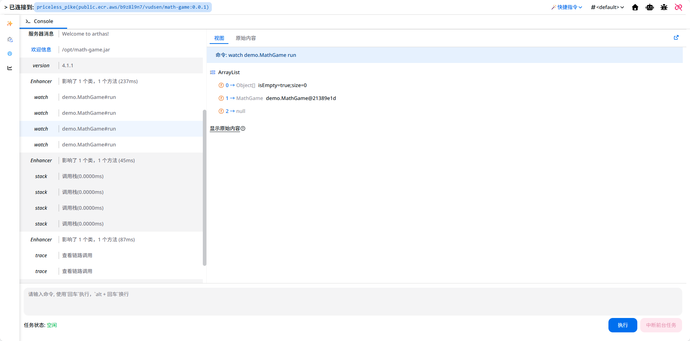

# Spectre

[在线体验](https://spectreproject.click) (账号：`public`/`P@ssw0rd`)

一个 Arthas 在线管理平台

📦: **零侵入性，无需为服务添加额外依赖进行集成**

🐳: 支持连接远程(SSH) Docker 容器以及本地运行的 JVM

☸️: Kubernetes 集群 Pod 连接支持

👮: 拥有完整的权限管理，允许限制用户可以执行的命令，使用更加放心

💻:  完美结合 Web 界面的优势，提供更加完善的界面展示以及操作体验

♨️: 支持运行在 Jre 环境的 JVM

## 本地部署

> [!CAUTION]
> 目前仅完成了基础的功能，但仍然处于开发阶段，可能会有许多安全漏洞，**请暂时不要在生产环境中使用**！！！

数据库要求：
- SQLite
- PostgreSQL 或其它支持该模式的数据库(需要手动加驱动)

中间件要求:
- Redis

### 启动后端

工具要求：

- Jdk: 17+

推荐使用 SQLite 启动，详见 [application.yaml](./deploy/self-env/application.yaml).

第一次启动会自动执行初始化 SQL。

初始的用户名密码为：`admin`/`P@ssw0rd`

### 启动前端

工具要求：

- NodeJs: 20+
- pnpm: 9+

具体说明请查看前端文件夹内的 [README.md](./spectre-frontend/README.md)
