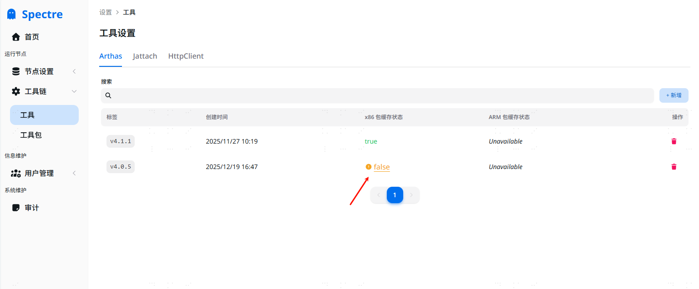
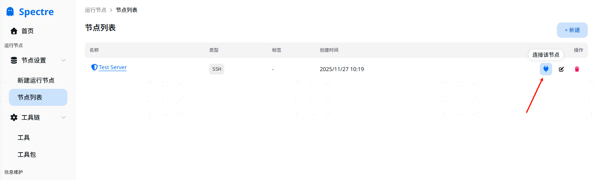
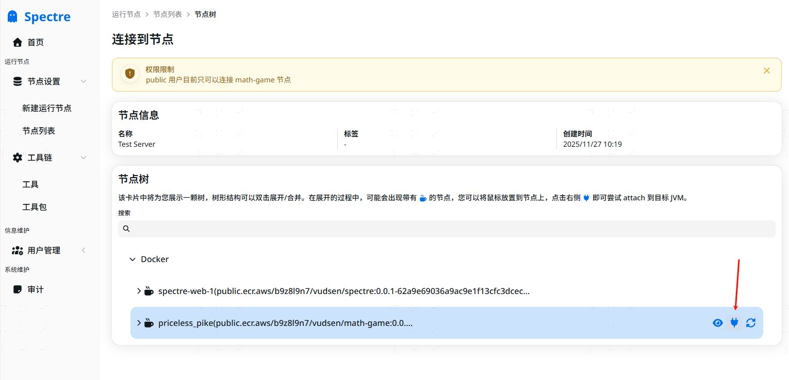

# Spectre

[在线体验](https://spectreproject.click) (账号：`public`/`P@ssw0rd`)

一个 Arthas 在线管理平台


📦: **零侵入性，无需为服务添加额外依赖进行集成**

🐳: 支持连接远程(SSH) Docker 容器以及本地运行的 JVM

☸️: Kubernetes 集群 Pod 连接支持

👮: 拥有完整的权限管理，允许限制用户可以执行的命令，使用更加放心

💻:  完美结合 Web 界面的优势，提供各种原版命令的增强以及更精美的界面

♨️: 支持运行在 Jre 环境的 JVM

## 增强功能

增强功能可以在连接到 JVM 后在左侧菜单选中(顶部预览图左侧菜单)。这些功能用于简化一些基础的操作：

- Retransform：允许直接在 web 界面上传 class 文件替换字节码


## 本地部署

> [!CAUTION]
> 目前为项目未经广泛验证，可能会有安全漏洞，**请暂时不要连接生产环境中的服务器**！！！


数据库要求：
- SQLite
- PostgreSQL

推荐使用 docker-compose 启动(不推荐以 root 用户启动，请使用 `sudo useradd -m spectre` 来创建一个专用账号):

```yaml
name: Spectre
services:
  web:
    user: spectre
    environment:
      SPECTRE_HOME: '/home/spectre/data'
    ports:
      - "80:8080"
    volumes:
      - ./application.yaml:/home/spectre/application.yaml
      - ./data:/home/spectre/data
      - ./logs:/home/spectre/logs
    working_dir: /home/spectre
    image: vudsen/spectre:latest
    command:
      - java
      - -Xmx1g
      - -jar
      - spectre.jar
```

配置文件:

```yaml
# application.yaml
spring:
  profiles:
    active: prod
  datasource:
    # 使用 sqlite，也可以使用 PostGresql，已经内置了驱动
    url: jdbc:sqlite:data/identifier.sqlite
  jpa:
    properties:
      hibernate:
        dialect: org.hibernate.community.dialect.SQLiteDialect
```

初始的用户名密码为：`admin`/`P@ssw0rd`

## 使用指南

### 快速开始

#### 1. 手动上传工具包

因为 Spectre 在第一次使用时会从 GitHub 上下载各种依赖的工具，例如 Arthas。

所以对于国内环境/离线环境需要手动上传工具包(如果可以联网，可以跳过这步，尝试自动下载)。

首先点击左侧菜单 `工具链` -> `工具`, 在第一次部署时会默认初始化所有需要的工具，然后查看 `包缓存状态` 一列：



可以看到值为 `false`，点击 `false` 后，会弹出一个上传对话框，然后手动下载对应的工具包上传即可。

#### 2. 创建运行节点

点击左侧菜单 `节点设置` -> `新建运行节点`，即可进入到运行节点创建界面。

一个运行节点可以简单理解为：一个运行着很多 JVM 的服务器。

目前支持 SSH(仅支持 Windows) 和 Kubernetes。

#### 3. 连接 JVM

点击左侧 `节点设置` -> `节点列表`，找到刚才创建的运行节点，在列表中点击一个类似插头的图标：



之后将会显示详细的节点树，该界面中找到需要连接的 JVM，点击插头图标，即可连接：



连接过程可能较长，请耐心等待。

#### 4. 执行命令

连接完成后，将会进入命令执行界面：


在下方输入框即可输入 Arthas 命令。


### 关于 Kubernetes

如果要连接到 Kubernetes，推荐参考 [k8s-full-roles.yaml](./deploy/k8s-full-roles.yaml) 以提供基础所需权限(`pods/exec` 和 `pods` 可以限制到命名空间范围)。


## 开发部署

开发工具要求：

- Java: 17
- NodeJs: 20+
- pnpm: 9+

### 启动后端

提供 redis 配置后直接启动即可。

### 启动前端

详见前端文件夹内的 [README.md](./spectre-frontend/README.md)
