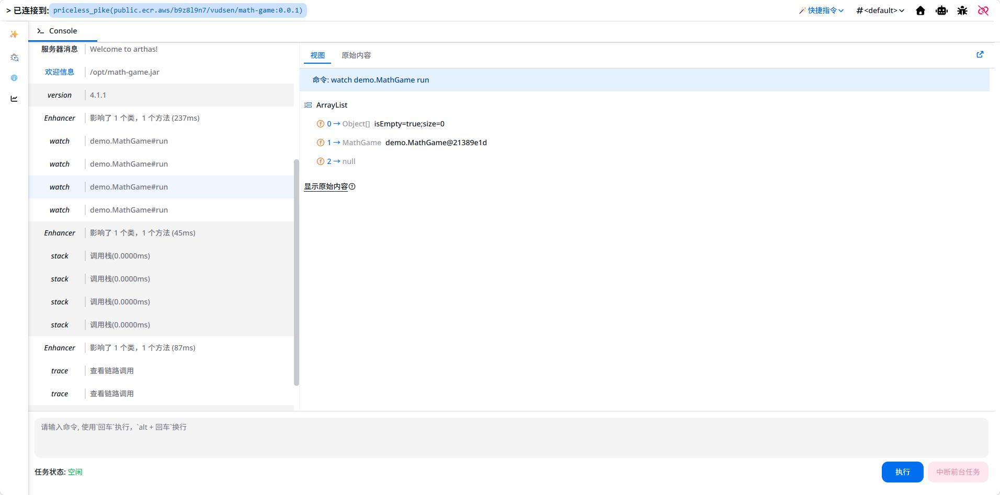
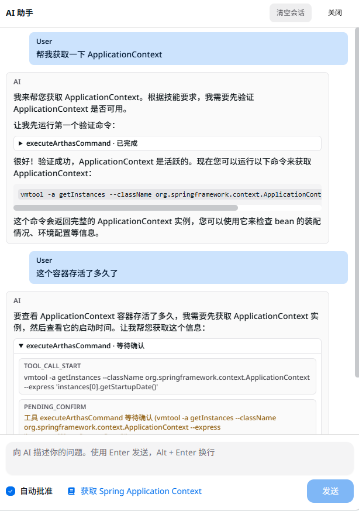
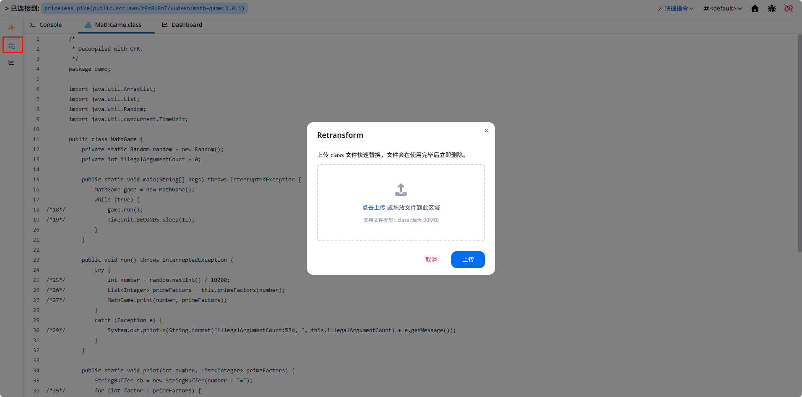
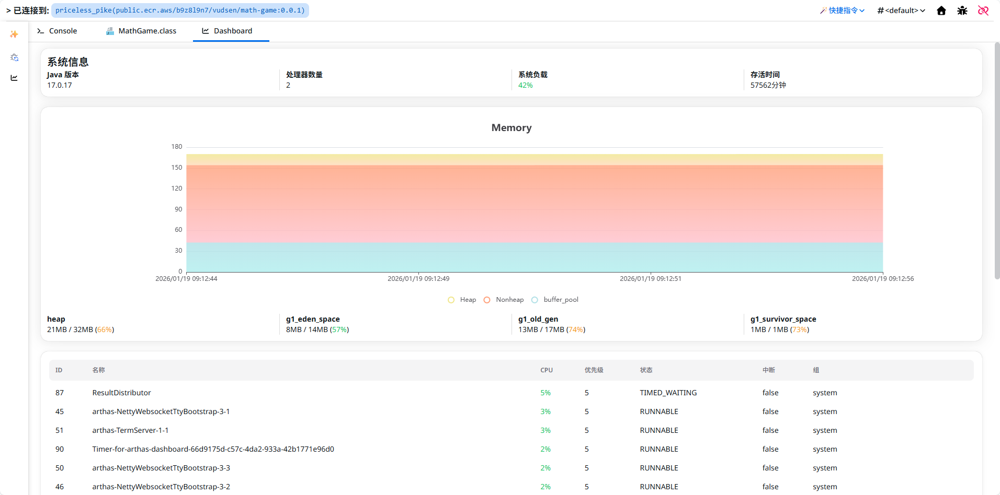
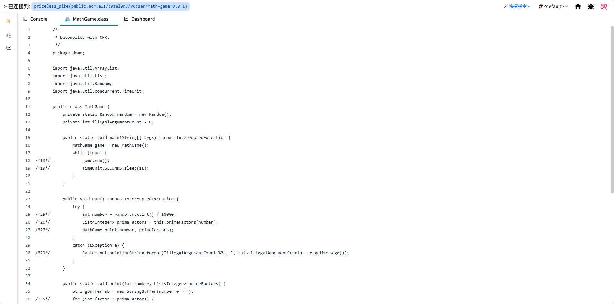
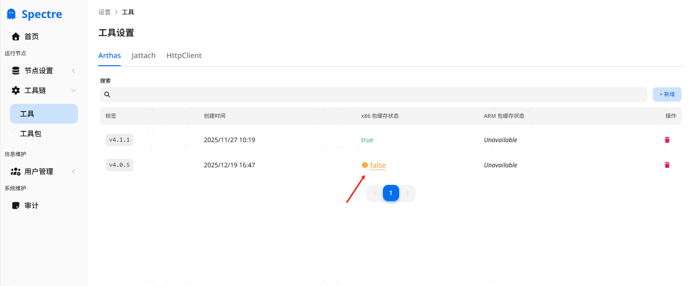
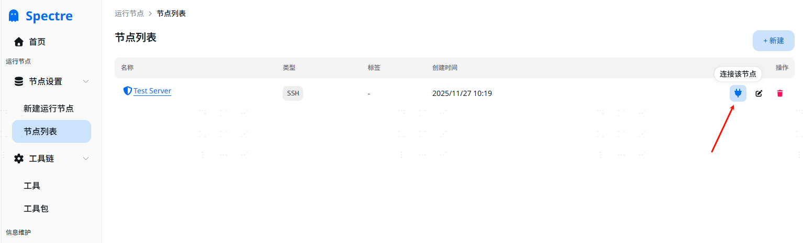
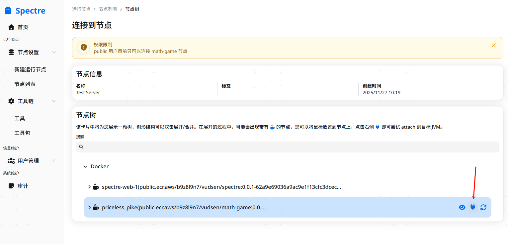

# Spectre

[简体中文](README.zh_CN.md)

[Try It Online](https://spectreproject.click) (Account：`public`/`P@ssw0rd`)

An Arthas Online Management Platform



📦: **Zero-invasion, no need to add extra dependencies to the service for integration**

🐳: Supports connecting to remote (SSH) Docker containers and locally running JVMs

☸️: Kubernetes cluster Pod connection support

👮: Has complete permission management, allowing restrictions on commands users can execute, for more secure usage

💻: Perfectly combines the advantages of the Web interface, providing enhancements to various original commands and a more refined interface

♨️: Supports JVMs running in Jre environments

🤖: Integrating AI and Arthas, and building automated troubleshooting capabilities based on Skills, enabling rapid online problem diagnosis.

## Implementation Principles

The service uses 3 core components (tools):
- arthas: The core tool, which opens an http interface for interaction after attaching to a JVM
- jattach: Used for connections in Jre environments
- [http-client](/cli/http-client): Used for interacting with the arthas http interface

Connection Flow:

1. Upload these 3 tools to the corresponding server/container.
2. Use shell commands, jattach + arthas to connect to the JVM, and enable arthas's http port (with basic authentication).
3. Interact using http-client, with Spectre acting as a "gateway" for authentication and invocation.

### Common Questions

**Q: Do servers/containers managed by Spectre need to expose the arthas http port?**

A: No, the entire interaction is done through http-client, and there's no need to expose the port externally.

**Q: Can I bypass Spectre and interact directly with arthas via http-client on the command line?**

A: No, unless you know the basic authentication password, which is randomly generated and stored in Spectre.

## Enhanced Features

We have enhanced some commands to make them more convenient to use and view.

### AI Integration

Integrate AI with Arthas to troubleshoot common problems:



### Retransform

Retransform allows you to upload class files directly through the web interface to replace bytecode. The files are deleted immediately after replacement.



### Dashboard



### Jad



## Local Deployment

> [!CAUTION]
> The project has not been extensively validated and may contain security vulnerabilities. **Please do not connect to production environment servers for now**!!!

Database Requirements:
- SQLite
- Postgresql

The initial username and password are: `admin`/`P@ssw0rd`

### Start Directly Using Docker

```shell
# prod 环境下不会往 stdout 输出日志
docker run -t vudsen/spectre:latest java -Dspring.profiles.active=dev -jar spectre.jar
```

### docker-compose

It is recommended to use docker-compose to start:

```yaml
name: Spectre
services:
  web:
    environment:
      SPECTRE_HOME: '/home/spectre/data'
      ENCRYPTOR_KEY: '<可选，base64 字符串>'
      ENCRYPTOR_SALT: '<可选，base64 字符串，可以只提供 key，不给 salt>'
    ports:
      - "80:8080"
    volumes:
      - ./application.yaml:/home/spectre/application.yaml
      - ./data:/home/spectre/data
      - ./logs:/home/spectre/logs
    working_dir: /home/spectre
    image: vudsen/spectre:latest
    command:
      - java
      - -Xmx1g
      - -jar
      - spectre.jar
```

**For mounted files/folders, manual authorization is required**:
```shell
chown -R 10001:10001 application.yaml ./data ./logs
```

Configuration File:

```yaml
# application.yaml
spring:
  profiles:
    active: prod
  datasource:
    # 也可以使用 Postgresql，已经内置了对应驱动
    url: jdbc:sqlite:data/identifier.sqlite
  jpa:
    properties:
      hibernate:
        dialect: org.hibernate.community.dialect.SQLiteDialect
```

## Usage Guide

### Quick Start

#### 1. Manually Upload Tool Package

Because Spectre downloads various dependent tools, such as Arthas, from GitHub on the first use.

Therefore, for domestic/offline environments, you need to manually upload the tool package (if you can connect to the internet, you can skip this step and try automatic download).

First, click on the left menu `工具链` -> `工具`, all necessary tools will be initialized by default during the first deployment, then check the `包缓存状态` column:



You can see the value is `false`, click `false` and an upload dialog will pop up. Then manually download the corresponding tool package and upload it.

#### 2. Create Runtime Node

Click on the left menu `节点设置` -> `新建运行节点` to enter the runtime node creation interface.

A runtime node can be simply understood as: a server running many JVMs.

Currently supports SSH (Windows only) and Kubernetes.

#### 3. Connect to JVM

Click on the left `节点设置` -> `节点列表`, find the runtime node you just created, and click on a plug-like icon in the list:



Then the detailed node tree will be displayed. In this interface, find the JVM you need to connect to and click the plug icon to connect:



The connection process may take a while, please be patient.

#### 4. Execute Command

After connecting, you will enter the command execution interface:


You can enter Arthas commands in the input box below.

### About Kubernetes

To connect to Kubernetes, it is recommended to refer to [k8s-full-roles.yaml](./deploy/k8s-full-roles.yaml) to provide the basic required permissions (`pods/exec` and `pods` can be limited to the namespace scope).

## Development and Deployment

Development Tool Requirements:

- Java: 17
- NodeJs: 20+
- pnpm: 9+

### Start Backend

Add command-line arguments:

```
-Dspring.profiles.active=dev
```

### Start Frontend

See [README.md](./spectre-frontend/README.md) in the frontend folder for details.